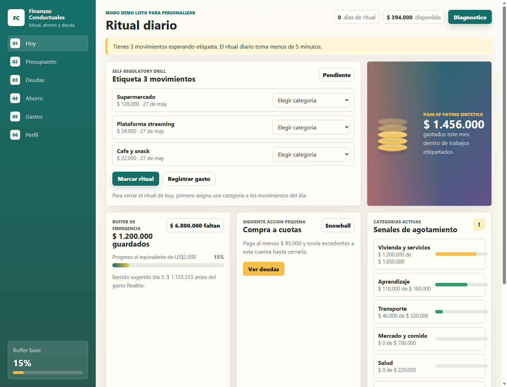

# Finanzas Conductuales

Aplicacion personal de finanzas basada en economia conductual. El objetivo no es solo mostrar saldos, sino convertir el manejo del dinero en un sistema de pequenas acciones repetibles: monitoreo diario, presupuesto por periodos, orientacion de ahorro y alertas visuales de gasto.



## Por que este proyecto suma al portafolio

- Traduce un PRD con investigacion conductual a una experiencia de producto funcional.
- Usa arquitectura frontend sin dependencias externas, ideal para GitHub Pages.
- Incluye cuentas con Supabase, persistencia local, PWA basica con cache offline y diseno responsive.
- Muestra decisiones de UX orientadas a cambio de comportamiento, no solo CRUD.

## Funcionalidades principales

- **Mis datos:** ingreso, gastos comprometidos, ahorro actual de referencia, ansiedad financiera, confianza y patrones de dinero.
- **Inicio minimo y accionable:** la app abre mostrando el dinero libre, cuenta/efectivo y las barras de categorias, sin historial ni graficas que distraigan.
- **Registro inmediato con FAB:** el boton flotante abre un panel rapido con categoria, origen y monto para guardar un gasto en pocos segundos.
- **Drawer + navegacion inferior:** Inicio, Registrar y Plan quedan siempre a un toque; Ahorro, Datos y nube viven en el menu lateral.
- **Jerarquia de dinero clara:** el libre del periodo es el numero protagonista; cuenta, efectivo y total real aparecen como datos secundarios.
- **Cuenta y efectivo:** separa el disponible entre dinero en cuenta y dinero fisico sin perder el total.
- **Acceso antes del onboarding:** cada usuario crea una cuenta o inicia sesion antes de configurar presupuesto, cuenta/efectivo y campos habituales.
- **Cierre de sesion:** disponible desde el menu y desde Datos; intenta guardar en nube y limpia la informacion local del dispositivo aun si la conexion falla.
- **Tema automatico:** adapta la interfaz clara u oscura segun el sistema.
- **Correccion de errores:** los gastos registrados se pueden eliminar desde el historial o deshacer directamente desde su categoria.
- **Dinero extra:** permite sumar regalos, bonos o ayudas al presupuesto del periodo sin cambiar el presupuesto base recurrente.
- **Sobres por periodo:** el presupuesto puede ser semanal, quincenal, mensual, semestral o anual; cada campo semanal, quincenal, mensual, semestral, anual o por periodo reserva automaticamente su parte.
- **Inicio accionable:** muestra el siguiente paso: poner datos reales, clasificar gastos, cerrar la revision o revisar la recomendacion de ahorro.
- **Contexto estudiante becado:** queda como preset opcional; sus campos solo se cargan al presionar "Aplicar mi contexto".
- **Simulador de ahorro:** recomienda cuanto apartar durante el periodo segun presupuesto, gastos comprometidos, campos reservados, movimientos e ingreso variable.
- **Zero-based budgeting:** cada categoria de gasto recibe un trabajo especifico.
- **Fondo de referencia:** simula una meta adaptada al ingreso mensual y a los gastos comprometidos, sin mover dinero ni modificar saldos.
- **Pausa de 24 horas:** detiene compras grandes no presupuestadas antes de registrarlas.
- **Alertas de agotamiento:** barras por categoria cambian de verde a amarillo y rojo.
- **Victorias de proceso:** celebra consistencia, no solo montos.

## Stack

- HTML, CSS y JavaScript vanilla.
- `localStorage` para persistencia personal.
- Service worker y manifest para comportamiento PWA.
- Tests con `node:test`, sin framework externo.
- Servidor local minimo en Node.js para desarrollo.

## Personalizacion real incluida

La app incluye un preset personal para un estudiante becado:

- Beca semestral: `$1.750.000`.
- Meses a cubrir: `6`.
- Ingreso mensual equivalente: cerca de `$291.667`.
- Moto: gasolina semanal de `$30.000`, convertida al presupuesto del periodo elegido.
- Campos iniciales: gasolina moto semanal, salidas con novia mensual, regalos para novia mensual y universidad/comida mensual.

La documentacion conductual base se conserva, pero el motor financiero ya no depende solo del contexto semestral: primero toma el presupuesto y su frecuencia, luego reserva campos segun su frecuencia y muestra el dinero libre para gastos aparte o sin clasificar.

## Ejecutar localmente

```bash
npm run check
npm test
npm start
```

Luego abre:

```text
http://127.0.0.1:4173
```

Tambien puedes abrir `index.html` directamente, aunque el service worker requiere servidor local.

## PWA y movil

La app incluye manifest, service worker, iconos PNG/SVG, soporte iOS con `apple-touch-icon` y cache offline de los archivos principales. Si pierdes conexion, puedes abrir la app instalada y usar la copia local; la sincronizacion con Supabase se reintenta cuando vuelve internet. Para instalarla en movil debe servirse por HTTPS; GitHub Pages cumple ese requisito.

En Android/Chrome: abre la demo publicada y elige "Instalar app" o "Agregar a pantalla principal".

En iPhone/Safari: abre la demo, toca compartir y luego "Agregar a pantalla de inicio".

## Cuentas y sincronizacion

Supabase es obligatorio para entrar a la aplicacion. Despues de iniciar sesion, `localStorage` mantiene una copia para uso offline y Supabase guarda una copia del estado financiero para compartir los datos entre computador y celular:

- Usuario nuevo: crea su cuenta y luego completa el onboarding financiero.
- Usuario existente: inicia sesion y descarga automaticamente sus datos.
- Inicio de sesion en otro dispositivo: si ya hay nube, la descarga automaticamente.
- Cada cambio posterior se sube solo, sin presionar "descargar nube".
- Cerrar sesion guarda la ultima copia en nube y elimina los datos locales del dispositivo.

Configuracion:

1. Crea un proyecto en Supabase.
2. En el SQL editor, ejecuta [docs/supabase-schema.sql](docs/supabase-schema.sql).
3. En Authentication, habilita Email/Password.
4. Copia `Project URL` y la `anon public key` o `publishable key`.
5. Edita `sync-config.js`:

```js
window.FINANZAS_SYNC_CONFIG = {
  supabaseUrl: "https://TU_PROYECTO.supabase.co",
  supabaseAnonKey: "TU_ANON_O_PUBLISHABLE_KEY"
};
```

La anon key o publishable key de Supabase es publica por diseno; la seguridad la controlan las politicas RLS del archivo SQL.

## Publicacion en GitHub Pages

Este repositorio incluye `.github/workflows/pages.yml`. Cuando el proyecto se suba a GitHub y Pages este configurado con **GitHub Actions** como fuente, cada push a `main` o `master` ejecutara tests y publicara la demo.

## Mapa PRD a producto

| Requisito conductual | Implementacion |
| --- | --- |
| Monitoreo financiero diario | Ritual de etiquetado y streak |
| Pain of paying sintetico | Alertas visuales de agotamiento por categoria |
| Save More Tomorrow | Simulador de ahorro ante aumentos futuros |
| Precautionary saving | Recomendacion adaptada al periodo y a la volatilidad del ingreso |
| Zero-based budgeting | Campos reservados dentro del presupuesto del periodo |
| Relapse response | Reencuadre cuando una categoria se excede |

## Roadmap

- Graficas historicas por mes.
- Modo multi-moneda.
- Integracion opcional con CSV bancario.
- Pruebas automatizadas de reglas financieras.
- Exportacion de reporte mensual en PDF.

## Nota de privacidad

La app guarda una copia local en el navegador para uso offline. Cuando inicias sesion, tambien sincroniza tu estado financiero con Supabase bajo las politicas RLS de [docs/supabase-schema.sql](docs/supabase-schema.sql), de modo que solo tu usuario pueda leer o escribir su registro.
